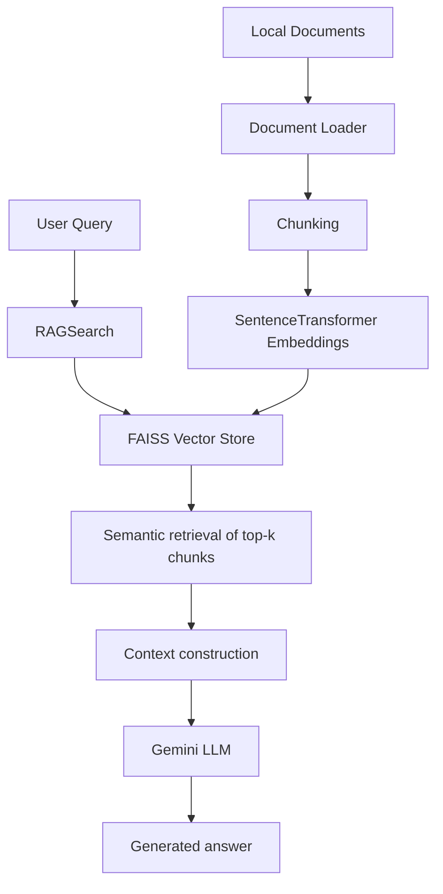

# RAG Document Intelligence System

A retrieval-augmented generation project that loads local documents, embeds them with a sentence-transformer model, stores them in a FAISS vector index, retrieves semantically similar chunks, and sends the retrieved context to Gemini for answer generation.

## 1. Overview

This repository implements a small but practical retrieval-augmented generation (RAG) pipeline for local document search and question answering. The project is designed around the idea that a language model should not rely only on its pretrained knowledge when the user asks questions about domain-specific or private documents.

The system performs the following steps:

1. Discover supported files under the project `data` directory.
2. Load the documents into LangChain document objects.
3. Split long text into smaller chunks.
4. Convert the chunks to vector embeddings using `all-MiniLM-L6-v2`.
5. Store the vectors in a FAISS index together with metadata.
6. Use semantic similarity search to retrieve the most relevant chunks for a query.
7. Construct a context from the retrieved chunks.
8. Send that context to Gemini through `ChatGoogleGenerativeAI`.
9. Return a generated response grounded in the retrieved context.

The main technologies in this repository are:

- Python
- LangChain
- FAISS
- SentenceTransformers
- Gemini via the Google Generative AI integration
- `python-dotenv` for environment variables

## 2. Research Motivation

### Problem

Large language models are useful for general-purpose reasoning, but they can still be limited when the user asks about specific documents, proprietary information, local knowledge, or newly introduced material that is not well represented in the model's training data.

This creates several practical issues:

- The model may not know the relevant document content.
- The model may produce plausible but unsupported answers.
- Document-specific facts may be missing or stale.
- Private or sensitive documents cannot be reliably used unless they are explicitly included in the retrieval process.

### Proposed Approach

This project addresses that problem by combining document retrieval with generation. Instead of asking the model to answer from memory alone, the system first retrieves the most relevant pieces of text and then asks the model to generate a response based on that retrieved context.

The implemented flow is:

```text
Documents
    ↓
Document Loading and Preprocessing
    ↓
Chunking
    ↓
Embeddings
    ↓
FAISS Vector Store
    ↓
Semantic Retrieval
    ↓
Relevant Context
    ↓
Gemini LLM
    ↓
Generated Response
```

This is the standard RAG pattern: retrieval first, then generation grounded in retrieved evidence.

## 3. System Architecture



### Components

- `data/`: Local document repository.
- `src/data_loader.py`: Finds and loads local files into LangChain document objects.
- `src/embedding.py`: Splits documents and creates embeddings with a sentence-transformer model.
- `src/vectorstore.py`: Maintains a FAISS index and metadata store.
- `src/search.py`: Implements the retrieval + Gemini summarization workflow.
- `.env`: Stores the Gemini API key outside the source tree.

## 4. RAG Pipeline

### Step 1 — Document Loading

The repository loads documents from the `data` directory using `load_all_documents` in `src/data_loader.py`. The implementation resolves the target directory with `Path(data_dir).resolve()`, then recursively scans for supported file types.

The current code explicitly supports:

- PDF
- TXT
- CSV
- Excel (`.xlsx`)
- Word (`.docx`)
- JSON

Each supported file type is loaded through a specific LangChain loader. For example:

- `PyPDFLoader` for PDF files
- `TextLoader` for text files
- `CSVLoader` for CSV files
- `UnstructuredExcelLoader` for Excel files
- `Docx2txtLoader` for Word files
- `JSONLoader` for JSON files

This loader layer produces a list of LangChain document objects that are later processed for indexing.

### Step 2 — Document Processing

The repository uses recursive chunking with `RecursiveCharacterTextSplitter`. The actual configuration in `src/embedding.py` and `src/vectorstore.py` is:

- `chunk_size = 1000`
- `chunk_overlap = 200`
- separators: `['\n\n', '\n', ' ', '']`

This means long documents are split into overlapping chunks before embedding. The overlap helps preserve continuity between adjacent segments.

### Step 3 — Embeddings

The embedding model used in the code is:

- `all-MiniLM-L6-v2`

This is instantiated with `SentenceTransformer(model_name)`. The embeddings are computed for each text chunk and stored in the vector database. Embeddings convert text into dense vectors so that semantically similar passages have similar vector representations.

### Step 4 — Vector Database

The project uses FAISS as its vector database. In `src/vectorstore.py`, it creates a `faiss.IndexFlatL2` for the embedding dimension and stores the vectors in a local index called `faiss.index`.

The vector store performs the following operations:

- Builds a FAISS index from embedded chunks.
- Stores metadata for each chunk.
- Saves the index to `persist_dir/faiss.index`.
- Saves chunk metadata to `persist_dir/metadata.pkl`.

The metadata is a Python pickle dump of the `self.metadata` list, where each entry is a dictionary like:

```python
{"text": chunk.page_content}
```

This lets the retrieval layer look up the original text corresponding to a vector nearest-neighbor match.

### Step 5 — Retrieval

The query path is implemented in `FaissVectorStore.query()` in `src/vectorstore.py`.

The logic is:

1. Encode the user query with the same sentence-transformer model.
2. Search the FAISS index for nearest neighbors.
3. Return the top `k` matches.

The parameter `top_k` is passed from `RAGSearch.search_and_summarize()`. In the current implementation, it defaults to 5 and is used to control how many relevant chunks are retrieved for context.

For example, if the query is `"NoSQL"`, the vector store will embed that phrase and ask FAISS for the nearest vectors among the indexed document chunks. The top results are assumed to represent the most relevant sections of the local corpus.

### Step 6 — Context Construction

Once the top chunks are retrieved, `RAGSearch.search_and_summarize()` extracts the text from their metadata and joins them into a unified context string:

```python
context = "\n\n".join(texts)
```

This assembled context is then passed to the language model as the evidence basis for the answer.

### Step 7 — Generation

The generation step uses `ChatGoogleGenerativeAI` from `langchain_google_genai`.

The project initializes the model with:

```python
ChatGoogleGenerativeAI(google_api_key=google_api_key, model=self.llm_model)
```

The current default model is:

- `gemini-3.7-flash`

The model is not asked to answer from memory alone. Instead, it receives the retrieved document context and a query-specific prompt, and it is expected to produce a grounded summary or answer based on the supplied text.

## 5. Technical Methodology

### 5.1 Semantic Representation

Text is represented as dense vectors using SentenceTransformers. The embedding model maps each chunk into a high-dimensional semantic space so that related passages are closer to each other in vector space than unrelated ones.

This is the core representation layer that supports semantic retrieval rather than exact keyword lookup only.

### 5.2 Similarity Search

The similarity step is performed with FAISS. The repository uses `faiss.IndexFlatL2`, which computes distances in vector space using the L2 metric. This means the nearest neighbors are chosen based on the distance between the query embedding and the stored document embeddings.

The code then converts the retrieved nearest-neighbor results into metadata-backed text chunks for downstream use.

### 5.3 Retrieval-Augmented Generation

The repository implements a straightforward retrieval-augmented generation pipeline:

1. Retrieve relevant document chunks from the vector store.
2. Assemble a context string.
3. Pass the context and query to Gemini.
4. Generate a response grounded in the retrieved text.

This separates the responsibilities clearly:

- Retrieval: find the most relevant chunks
- Augmentation: combine those chunks into context
- Generation: produce the final answer using the LLM

## 6. Implementation Details

| Component | Technology | Purpose |
| --- | --- | --- |
| Core language | Python | Main application logic |
| Embedding model | `all-MiniLM-L6-v2` | Converts text chunks into vectors |
| Vector database | FAISS | Stores embeddings and performs similarity search |
| Document loaders | LangChain loaders | Reads PDFs, TXT, CSV, Excel, DOCX, JSON |
| Chunking | `RecursiveCharacterTextSplitter` | Splits long text into overlapping segments |
| LLM | Gemini / `ChatGoogleGenerativeAI` | Generates responses from retrieved context |
| Environment management | `python-dotenv` | Loads API keys from a local `.env` file |
| Persistence | FAISS + pickle metadata | Saves vector index and metadata |

### Python Version

The `pyproject.toml` declares:

```toml
requires-python = ">=3.11"
```

### Main Dependencies

The repository includes dependencies such as:

- `langchain`
- `langchain-community`
- `langchain-core`
- `numpy`
- `pypdf`
- `pymupdf`
- `sentence-transformers`
- `faiss-cpu`
- `chromadb`
- `python-dotenv`

### Environment and API Configuration

The project expects a local `.env` file at the project root. The README should not include the real secret value, but the expected pattern is:

```env
GEMINI_API_KEY=your_api_key_here
```

The code accepts either `GEMINI_API_KEY` or `GOOGLE_API_KEY` when initializing the Gemini client.

## 7. Project Structure

```text
rag/
├── .env
├── .gitignore
├── .python-version
├── README.md
├── requirements.txt
├── pyproject.toml
├── main.py
├── data/
│   ├── pdf/
│   └── text_files/
├── faiss_store/
│   ├── faiss.index
│   └── metadata.pkl
├── notebook/
│   ├── document.ipynb
│   └── pdf_loade.ipynb
├── src/
│   ├── __init__.py
│   ├── app.py
│   ├── data_loader.py
│   ├── embedding.py
│   ├── search.py
│   └── vectorstore.py
└── .venv/
```

### Important Files

- `src/data_loader.py`: Finds and loads all supported files from `data/`.
- `src/embedding.py`: Implements chunking and embedding generation.
- `src/vectorstore.py`: Builds, saves, loads, and queries the FAISS vector store.
- `src/search.py`: Executes the end-to-end retrieval-and-generation flow.
- `src/app.py`: Provides an embedding example workflow and is not the full RAG summary runner in its current implementation.
- `data/`: The local document source used for indexing.
- `faiss_store/`: Persistent vector store output.
- `requirements.txt`: Dependency list for the project.
- `.env`: Local configuration file for API keys.

## 8. Installation

1. Clone the repository:

```bash
git clone <repository-url>
cd rag
```

2. Create and activate a virtual environment:

### Windows

```powershell
python -m venv .venv
.venv\Scripts\Activate.ps1
```

### macOS / Linux

```bash
python -m venv .venv
source .venv/bin/activate
```

3. Install the dependencies:

```bash
pip install -r requirements.txt
```

4. Create a `.env` file in the project root and add your Gemini API key:

```env
GEMINI_API_KEY=your_api_key_here
```

5. Run the project according to the current implementation.

## 9. Environment Variables

The project reads environment variables with `python-dotenv`.

The currently expected variable is:

```env
GEMINI_API_KEY=your_api_key_here
```

The code also checks for `GOOGLE_API_KEY` as a fallback name.

Important notes:

- Do not commit the `.env` file to version control.
- Keep API keys outside the repository.
- Use a local secret management strategy for any real deployment.

## 10. Usage

The project is currently structured around the RAG retrieval flow in `src/search.py`.

A direct usage pattern is:

```python
from src.search import RAGSearch

rag = RAGSearch(persist_dir="faiss_store", llm_model="gemini-3.7-flash")
answer = rag.search_and_summarize("NoSQL", top_k=3)
print(answer)
```

This triggers:

- load or build vector store
- encode the query
- retrieve top-k matching chunks
- build a prompt context
- invoke the Gemini model
- print the generated answer

## 11. Example Walkthrough

### Query

```text
NoSQL
```

### Execution flow

```text
Query
  ↓
Query embedding
  ↓
FAISS nearest-neighbor search
  ↓
Top-K relevant chunks
  ↓
Context assembly
  ↓
Gemini prompt
  ↓
Generated summary
```

### What happens internally

1. The query string is encoded as an embedding.
2. FAISS searches the stored document embeddings.
3. The most relevant chunk texts are retrieved.
4. Their text is combined into a single context block.
5. The query and context are sent to Gemini.
6. Gemini returns a response based on the retrieved evidence.

This is the key idea behind the repository: the model does not rely solely on raw pretrained memory when answering a domain-specific question.

## 12. Research / Experimental Perspective

### Objective

The project demonstrates a minimal retrieval-augmented generation pipeline for local document search and answer generation.

### Method

The method currently implemented is:

- load documents from a local folder
- split into chunks
- embed chunks with a sentence-transformer
- store vectors in FAISS
- retrieve nearest chunks for a query
- pass those chunks to Gemini for generation

### Configuration

The repository currently uses the following concrete configuration:

- Embedding model: `all-MiniLM-L6-v2`
- Vector store: FAISS
- LLM: `gemini-3.7-flash`
- Retrieval size: `top_k` is configurable and defaults to 5 in `RAGSearch.search_and_summarize()`
- Persistence: `faiss_store/faiss.index` and `faiss_store/metadata.pkl`

### Observations

The repository includes the actual working code path for retrieval and generation and has demonstrated successful execution in the current environment for a simple query flow. The project is a practical implementation template, not a benchmark suite.

Quantitative retrieval and answer-quality evaluation is not currently implemented.

## 13. Limitations

The current implementation has several important limitations:

- Retrieval quality depends on the chunking strategy and embedding model.
- The default `top_k` value is fixed unless changed in code.
- There is no reranking step after retrieval.
- There is no explicit evaluation pipeline for retrieval quality or answer quality.
- The system depends on API availability and quota for Gemini.
- A local `.env` file is required for the API key.
- The implementation does not currently include conversation memory across multiple turns.
- The app and the RAG search logic are not fully unified in a single end-to-end CLI entry point in the current codebase.

## 14. Future Improvements

The following improvements are technically meaningful next steps:

1. More advanced chunking policies based on heading structure or semantic boundaries.
2. Metadata-aware filtering during retrieval.
3. Re-ranking of retrieved chunks before generation.
4. Hybrid retrieval combining keyword search and vector search.
5. Evaluation scripts for retrieval and answer quality.
6. Source tracking and citations in generated responses.
7. Streaming responses from the LLM.
8. Conversation memory for multi-turn interactions.
9. A web or API interface for serving the system.
10. Better handling of large document collections and index updates.

## 15. Learning Outcomes

This repository is useful for learning the core RAG workflow:

- how embeddings represent text
- how vector databases support semantic retrieval
- how FAISS works at a practical level
- how LangChain loaders integrate document sources
- how a retrieval step can ground LLM output
- how environment variables control API access
- how persistent vector indices are saved and reused

## 16. Security Notes

This project handles a Gemini API key and therefore should be treated as a secrets-bearing application.

Recommended practices:

- keep the API key in `.env`
- do not commit `.env` to GitHub
- add `.env` to `.gitignore`
- avoid printing secrets in logs
- use a local environment or secret manager instead of storing keys in source code

## 17. Dependencies

The repository depends on several major libraries:

- `langchain` and related packages for document loading and LLM integration
- `sentence-transformers` for embeddings
- `faiss-cpu` for vector indexing and search
- `chromadb` for an alternative vector database implementation that may be explored in notebooks or experiments
- `pypdf` and `pymupdf` for PDF parsing
- `python-dotenv` for environment variable loading

These libraries are necessary to the current implementation and reflect the project’s document loading, vector search, and retrieval-based generation workflow.

## 18. Conclusion

This project demonstrates a compact but practical retrieval-augmented generation system for local documents. It uses semantic embeddings and vector search to retrieve the most relevant portions of a document collection, then passes that evidence to Gemini to produce a response grounded in retrieved context.

The overall architecture is intentionally simple and instructive: document loading, chunking, embedding, FAISS indexing, retrieval, and LLM augmentation. It is well suited as a learning repository for understanding how RAG systems work in practice, while also serving as a starting point for more advanced retrieval and evaluation pipelines.

## 19. Notes on Current Implementation Status

The repository currently contains a working retrieval and generation flow in `src/search.py`, while `src/app.py` is best understood as an embedding-processing example rather than the full end-to-end RAG runner. The code is functional for local document ingestion and retrieval, and the model integration is configured using a Gemini API key in `.env`.

Not specified in the current implementation:

- a production web API
- automated evaluation benchmarks
- user authentication
- document indexing service
- multi-user session management
- conversation memory across independent queries

This README reflects the implementation that exists in the repository as of the current state of the code.

